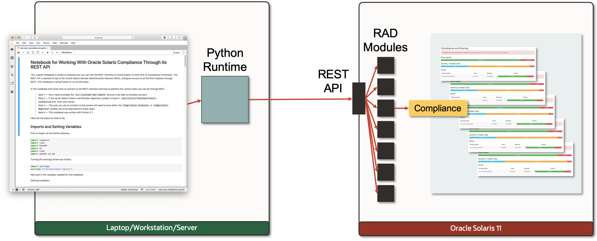

# Using Jupyter Notebooks

This directory contains a set of Jupyter Notebooks that show how to use the Oracle Solaris REST API. The REST API is layered on top of the [Oracle Solaris Remote Administration Daemon (RAD)](https://docs.oracle.com/cd/E37838_01/html/E68270/index.html) which allows remote and local management access to the system. Managing the various parts of Oracle Solaris is done through corresponding RAD modules. By layering the REST API on top of RAD anyone using this REST API can directly use all of the functionality in these RAD modules.

In the featured Jupyter notebooks we're making use of the Python `requests` module to talk to the REST API in Oracle Solaris. Where the intent is to show how using the `requests` module you can access the various parts of the RAD module and how to use them. As an example *Figure 1* is showning how you can use Jupyter to run Python `requests` calls to the *Compliance* RAD module.

**Figure 1 — Connecting from Jupyter to RAD/REST**

One of the benefits of using Python and Jupyter notebooks is that every step of connecting to and working with the REST API and the RAD modules can be well explained. Making it easy to translate this to other tools you want to use REST to talk to the Oracle Solaris instance. And because the Jupyter notebook is "live" it is also easy to make your won changes and test the things relevant to your set up.

Note that every Oracle Solaris Zone and Logical Domain has its own RAD/REST interface which can be independently turned on and accessed. 

Some resources to get started:

- [How to install Jupyter](https://jupyter.org/install) and for those that want to run it on Oracle Solaris [how to install Jupyter on Oracle Solaris](installing_jupyter_on_oracle_solaris.md), also showing how to remotely connect to a running notebook server.
- [How to turn remote connection on](../../setting_up_the_connection.md)

Copyright (c) 2020, Oracle and/or its affiliates. Licensed under the Universal Permissive License v 1.0 as shown at https://oss.oracle.com/licenses/upl/.